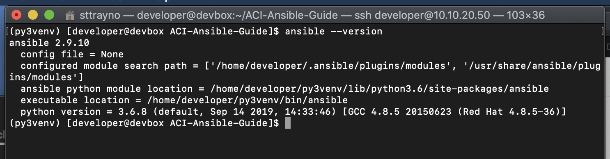

# Cisco ACI with Ansible Guide

Ansible is an increasingly popular tool for network automation, it allows engineers to define playbooks which carry out tasks you are looking to automate by interacting with a device or controller through the CLI or API. It is particularly popular in data centre and cloud environments. In this short exercise we're going to show how Ansible can be used with Cisco's data centre networking solution ACI to look at building the beginngings of an Infrastructure as Code solution with Ansible. In Ansible we define playbooks which instructs Ansible in order for the tasks you wish to accomplish, we'll cover more on this in a bit.

It should be said that Ansible is just one automation tool that can be used, you might have also heard of the tool Terraform which we also have a guide to look at getting started automating ACI using and can be found [here](https://github.com/sttrayno/Terraform-Lab-Guide).

Today in ACI, there are over 100 modules in Ansible for working with ACI which will allow you to work quite extensively with both ACI and MSO (Multi service orchestrator). A full list can be found [here](https://docs.ansible.com/ansible/latest/modules/list_of_network_modules.html#network-modules) which is constantly being added to. Today we'll look at a few of them and show you how you can get started and give some practical examples and give you some example playbooks to use and adapt.

## Prerequsites

For these exercises we'll first need a machine with Ansible installed so that we can run our playbooks.

A popular way of running Ansible is through Ansible Tower, commercial offering intended for teams looking to operationalise Ansible. Tower provides many features ontop of Ansible including a frontend, RBAC, a lot of out the box integrations and provides reporting, a GUI and a REST API. Organisations looking to operationalise Ansible may use this for the advantages mentioned. However for someone learning we can drive our playbooks from the CLI using the classic Ansible packages.

There are are multiple guides for installing Ansible that can be found from the Ansible documentation, it's probably best to start [here](https://docs.ansible.com/ansible/latest/installation_guide/intro_installation.html) for your platform for the most up to date walkthrough. Please note that the playbooks in this exercise have not yet been adapted to the newest version of Ansible 2.10 and will need 2.9 to run.

To test Ansible is installed and configured correctly simply run the command `Ansible --version` from your terminal you should see an output like below. 



To run these exercises you will need an instance of ACI. [dCloud](dcloud.cisco.com) has a couple of instances of ACI that you can reserve and use in this lab aswell as the DevNet sandbox. We'll be using the ["Cisco ACI Simulator 4.2"](https://devnetsandbox.cisco.com/RM/Topology) and running our Ansible playbooks from the DevBox included in this reservation. This works well for this exercise as it has Ansible 2.9 preinstalled which is what our exercises are based on.

## Exercise 1 - Running your first playbook

### The inventory file

Most of the time when working with Ansible, you will need an inventory file in order that Ansible knows the APIC it is going to manage. In this lab we have a sample inventory file for the DevNet ACI 4.2 sandbox which we will be using. You can see how it is laid out below. Notice that we're defining a group of hosts called apic which will be referred to in our playbooks later. We also define some variables such as the username and password we'll use to login to the APIC controller.

```yaml
[apic:vars]
username=admin
password=C1sco12345
ansible_python_interpreter="/usr/bin/env python"

[apic]
10.10.20.14
```

If your environment is different you can edit the file to suit your setup. It can be found under `inventory/host.yaml`. This file is specifically wrote for those using the DevNet sandbox.

### The playbooks

Now lets take a look at our playbooks, in this guide we've taken the approach to separate out our playbooks to create specific resources and features. To start with we'll look at a playbook for creating tenants as tenants are the highest-level object inside the ACI object model therefore all other resources we create will depend on tenants. Once we've created the tenants we'll then go on to create other resources within our ACI environment, for now lets start with tenants. If you look at the tenants.yaml file inside the playbook directory you should see something like this:

```yaml
---
- name: VERIFY TENANTS
  hosts: apic
  connection: local
  gather_facts: False

  tasks:

    - name: include variables for devices
      include_vars:
        file: ../vars/tenants.yaml
        name: tenants

    - name: ENSURE APPLICATIONS TENANT EXISTS
      aci_tenant:
        host: "{{ inventory_hostname }}"
        username: "{{ username }}"
        password: "{{ password }}"
        state: "present"
        validate_certs: False
        tenant: "{{ item.value.Tenant_name }}"
        description: "{{ item.value.description }}"
      loop: "{{ lookup('dict', tenants) }}"
```

As you can see the first task in the playbook is to load the tenants.yaml file in the vars directory and save it to a variable called "tenants", this variable contains all of our tenant names and a description of each tenant. Our playbook will loop through this dictionary and create each item. This allows you to effectively define what you want your infrastructure to look like in YAML code.

The second task is then using the aci_tenant module to create the Tenants as per the variables file loaded in the first task. With a loop command at the end which will ensure that the correct number of tenants are created.

### The variables

```yaml
---
 Tenant-1:
    Tenant_name: CustomerA
    description: Test

 Tenant-2:
    Tenant_name: CustomerB
    description: Test

 Tenant-3:
    Tenant_name: CustomerC
    description: Test

 Tenant-4:
    Tenant_name: CustomerD
    description: Test

 Tenant-5:
    Tenant_name: CustomerE
    description: Test
```

### Running a playbook

Now all thats left to do is run the playbook, this can be done using the `ansible-playbook` command from the bash prompt.

```bash
ansible-playbook playbooks/tenants.yaml -i inventory/host.yaml 
```


### A few more...


